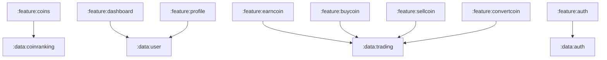

## Functional Requirements

| Назва вимоги                                              |
| --------------------------------------------------------- |
| FR1. Авторизація;                                         |
| FR2. Перегляд списку монет;                               |
| FR3. Пошук монет;                                         |
| FR4. Перегляд інформації про монету;                      |
| FR5. Додавання у обране;                                  |
| FR6. Перегляд загального балансу;                         |
| FR7. Перегляд монет користувача;                          |
| FR8. Отримання щоденних тестових грошей;                  |
| FR9. Купівля монет;                                       |
| FR10. Продаж монет;                                       |
| FR11. Конвертація монет;                                  |
| FR12. Повідомлення про можливість отримати щоденні кошти; |
| FR13. Налаштування повідомлень;                           |
| FR14. Перегляд інформації про монету користувача;         |

## Screens

|       Назва екрану        | FR які задоволняє |                    Опис                     | Назва feature-модулю до якого відноситься |
| :-----------------------: | :---------------: | :-----------------------------------------: | ----------------------------------------- |
|       Coins Screen        |  FR2, FR5, FR6,   |             Екран списку монет              | :feature:coins                            |
|    SearchCoins Screen     |        FR3        |             Екран пошуку монет              | :feature:coins                            |
|    CoinDetails Screen     |        FR4        |           Екран з деталями монет            | :feature:coins                            |
|     Dashboard Screen      |        FR7        | Екран з монетами та інформацією користувача |                                           |
|        Earn Screen        |        FR8        |       Екран отримання щоденних коштів       |                                           |
|      BuyCoin Screen       |        FR9        |            Екран закупівлі монет            |                                           |
|      SellCoin Screen      |       FR10        |             Екран продажу монет             |                                           |
|    ConvertCoin Screen     |       FR11        |           Екран конвертації монет           |                                           |
|     СhooseCoin Screen     |     FR9, FR10     |   Екран вибору монети для купівлі/продажу   |                                           |
|      Profile Screen       |    FR12, FR13     |  Екран профілю та налаштунків користувача   |                                           |
| ApproveTransaction Screen |     FR9, FR10     |     Екран підтвердження купівлі/продажу     |                                           |
|  UserCoinDetails Screen   |       FR14        |  Екран з історією транзакцій певної монети  |                                           |

## Modules

